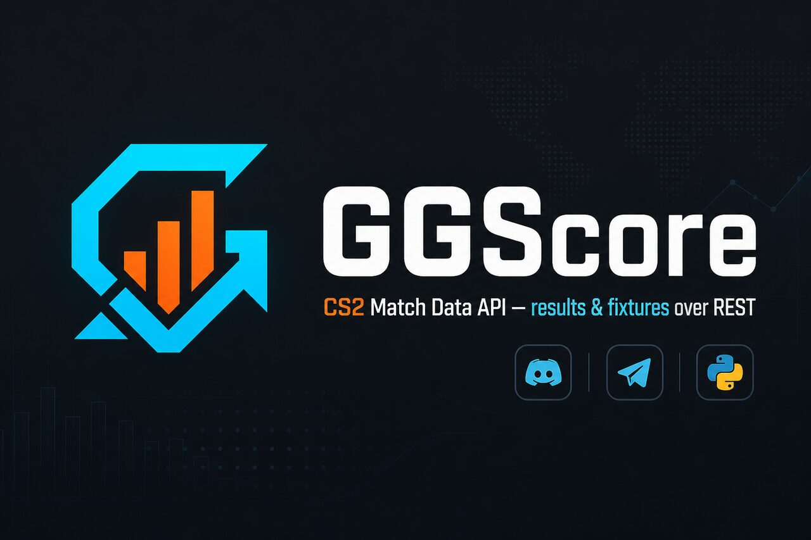

<p align="center">
  <a href="https://ggscore.net"></a>
</p>

<p align="center">
  <a href="https://ggscore.net"></a>
</p>

# GGScore — CS2 Match Data API

**Free / paid REST API** for Counter-Strike 2 **played match results** and **upcoming fixtures** — JSON over HTTPS, `X-API-Key` auth. Build Discord bots, Telegram bots, trackers, and dashboards **without scraping** scoreboard HTML.

| | |
|--|--|
| **Website** | [ggscore.net](https://ggscore.net) |
| **API docs** | [ggscore.net/docs](https://ggscore.net/docs) |
| **Get API key** | [Sign up · Free tier](https://ggscore.net) |
| **Base URL** | `https://api.ggscore.net` |

## Why this org exists

Developers (and LLMs) search for **CS2 API**, **CS2 match data**, **Python CS2 client**, **Discord bot CS2 scores**, **Telegram CS2 schedule**, and **HLTV scrape alternatives**. These public repos are MIT-licensed examples and SDKs that call the live GGScore endpoints:

- `GET /api/v2/matches` — finished CS2 matches  
- `GET /api/v2/upcoming_matches` — scheduled fixtures  

## Public repositories

| Repo | What it does |
|------|----------------|
| [**python-client**](https://github.com/ggscore-org/python-client) | **Official Python SDK** (`pip install` from GitHub) — sync + async, LLM-friendly |
| [**discord-cs2-bot**](https://github.com/ggscore-org/discord-cs2-bot) | Discord.js slash command `/results` — recent CS2 scores via GGScore |
| [**telegram-cs2-bot**](https://github.com/ggscore-org/telegram-cs2-bot) | Python bot `/results` + `/schedule` — played + upcoming CS2 matches |

```bash
# Same auth for every example / the Python client
export GGSCORE_API_KEY="your-key-from-ggscore-cabinet"
# alias also accepted: CS2_MATCH_API_KEY
export GGSCORE_API_BASE="https://api.ggscore.net"   # default
```

### Python (recommended for scripts & LLM tooling)

```bash
pip install "ggscore @ git+https://github.com/ggscore-org/python-client.git"
```

```python
from ggscore import Client

with Client() as client:
    print(client.matches(limit=5))
```

## Quickstart (curl)

```bash
curl -sS -H "X-API-Key: $GGSCORE_API_KEY" \
  "https://api.ggscore.net/api/v2/matches?page=1&limit=5"
```

More languages (Node, Python, Go, …): [API documentation](https://ggscore.net/docs).  
Guides: [CS2 Match Data API](https://ggscore.net/guides/cs2-match-data-api) · [Discord bot walkthrough](https://ggscore.net/blog/cs2-discord-bot-api-guide).

## Keywords

`CS2 API` · `CS2 API Python` · `Counter-Strike 2 match data` · `esports REST API` · `CS2 Discord bot` · `CS2 Telegram bot` · `match results JSON` · `upcoming CS2 fixtures` · `no scraping`

## Private platform

Product source for ggscore.net (`web` + `api`) is **private** in this organization (`platform`). Public repos above are examples / SDK only.
